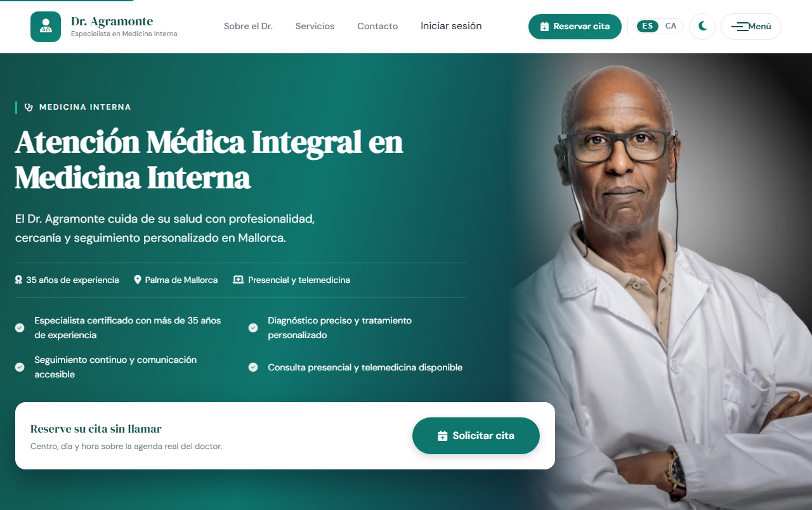

# Dr. Agramonte

Plataforma de gestión de citas médicas para la consulta de un internista real en Palma de Mallorca.
Los pacientes reservan, consultan y cancelan sus citas por su cuenta, sin depender del teléfono.

**En producción:** [www.dragramonte.com](https://www.dragramonte.com)

`Java 21` · `Spring Boot 3.5` · `PostgreSQL 15` · `JavaScript` · `Docker` · `Caddy`



---

## El problema

Buena parte de las llamadas que recibe un médico fuera de su horario no son urgencias
clínicas: son gestión de agenda. Cambiar una hora, preguntar por un hueco, cancelar.
Esa carga administrativa se come tiempo que no está pagado ni contabilizado como trabajo.

Este proyecto digitaliza esa parte concreta, sin tocar lo que sí requiere trato humano.

## Qué hace

- **Reserva sin registro previo** o con cuenta: centro → fecha → hora → datos.
- **Disponibilidad real** calculada en el servidor, repartida por centro y día.
- **Cobertura y pago**: consulta privada con precio visible, o seguro médico con aseguradora.
- **Avisos automáticos** de confirmación, cancelación y recordatorio 24 h antes.
- **Cuadro de mando** para el profesional: carga por médico, demanda por especialidad,
  reparto por centro y tasa de cancelación.
- **PWA instalable**, accesible (WCAG 2.1 AA), con modo oscuro y modo sin conexión.

## Arquitectura

```
[Navegador]  →  [nginx]  →  HTML/CSS/JS + proxy /api
                              ↓
                     [Spring Boot]  →  [PostgreSQL]
                              ↓
                   [Twilio]   [Telegram]
```

En local son tres contenedores (nginx, backend, base de datos). En el VPS también son
tres, pero distintos: Caddy termina el HTTPS por delante de un único contenedor donde Spring
Boot sirve la API y el frontend juntos —sin nginx aparte y sin CORS entre ambos— y PostgreSQL,
que no publica ningún puerto fuera de la red interna.

---

## Decisiones técnicas

Las cuatro que más me costaron y mejor explican el proyecto.

### Dos pacientes, el mismo hueco, el mismo segundo

La reserva bloquea la fila del horario con `SELECT ... FOR UPDATE` (bloqueo pesimista)
dentro de la transacción, sobre un índice `UNIQUE (medico_id, inicio)`. La primera
transacción gana y marca el hueco como ocupado; la segunda recibe **409 Conflict** sin
persistir nada.

No es teoría: hay un test que lanza dos hilos sincronizados con `CyclicBarrier` contra la
misma franja, sobre un PostgreSQL real levantado con Testcontainers, y comprueba que sale
exactamente un 201 y un 409. Un H2 en memoria no reproduce este comportamiento.

### El aviso se envía después del commit, no durante

Las notificaciones se aplazan a la fase `afterCommit` de la transacción. Así no se mantiene
la fila bloqueada durante una llamada de red, y si la transacción se revierte nunca se
avisa de una cita que en realidad no llegó a existir.

### Dos canales de aviso independientes

Twilio (SMS/WhatsApp) y un bot de Telegram. Twilio en cuenta de prueba obliga al paciente a
darse de alta en un *sandbox*, lo cual no vale para un producto real; Telegram es gratuito y
no exige alta previa. Ninguno de los dos puede tumbar una reserva: los servicios de
mensajería no propagan la excepción, solo la registran. Si uno está caído o apagado, el otro
sigue avisando.

La vinculación del bot usa un token de un solo uso con 15 minutos de validez, emitido
siempre para el usuario del JWT en sesión, nunca para un email recibido por parámetro.

### Frontend sin framework

Al principio valoré React. La aplicación no maneja un estado global que lo justifique, así
que preferí JavaScript modular: menos dependencias, carga más rápida y código que se lee sin
aprender antes una librería. Saber cuándo *no* añadir una tecnología también es una decisión.

---

## Puesta en marcha

Requiere **Docker Desktop**. Para compilar el backend por separado, JDK 21 y Maven 3.9+.

```bash
cp .env.example .env          # editar JWT_SECRET
docker compose up -d --build
```

- Web: <http://localhost>
- API: <http://localhost:8080>

Usuario médico de prueba (lo crea la migración V3): `dr.agramonte@example.com` / `Medico123!`

Para **producción** (servidor propio con dominio y HTTPS) hay un compose aparte,
`docker-compose.prod.yml`: ver [docs/DESPLIEGUE-VPS.md](docs/DESPLIEGUE-VPS.md).

<details>
<summary>Backend sin Docker · perfil MySQL</summary>

```bash
cd backend
mvn spring-boot:run

# Perfil MySQL alternativo (API en :8081)
docker compose --profile mysql up -d --build
```

</details>

## Pruebas

```bash
cd backend && mvn test
```

**47 pruebas en tres niveles**: unitarias de servicio, de seguridad y roles sobre la capa
REST (`@WebMvcTest` con la `SecurityConfig` real) y de integración end-to-end contra un
PostgreSQL levantado con Testcontainers. Cubren las ramas críticas: 409 por doble reserva,
403 por rol, validez del JWT, cancelación y el secreto del webhook.

Las 5 de integración necesitan Docker en marcha; si no lo hay se marcan como saltadas en
lugar de fallar. La cobertura todavía no está medida con JaCoCo.

También hay análisis de vulnerabilidades de dependencias con **OWASP dependency-check**,
configurado para hacer fallar el build con CVSS ≥ 7.

---

## API

| Método | Ruta | Uso |
|--------|------|-----|
| `POST` | `/api/auth/login`, `/api/auth/registro` | Sesión JWT |
| `GET` | `/api/medicos`, `/api/centros` | Catálogos |
| `GET` | `/api/disponibilidad` | Huecos por médico, fecha y centro |
| `POST` | `/api/citas` | Crear cita (paciente autenticado) |
| `POST` | `/api/citas/reserva-publica` | Reservar sin cuenta previa |
| `GET` | `/api/citas/mias` · `/api/citas/por-email` | Citas del paciente / del invitado |
| `DELETE` | `/api/citas/{id}` · `/api/citas/publica/{id}` | Cancelación |
| `GET` | `/api/citas/agenda/reservas`, `/agenda/pacientes` | Agenda del médico — rol `MEDICO`/`ADMIN` |
| `GET` | `/api/estadisticas` | Cuadro de mando — rol `MEDICO`/`ADMIN` |
| `GET`&nbsp;`POST`&nbsp;`DELETE` | `/api/telegram/vinculacion` | Alta y baja del canal Telegram |
| `POST` | `/api/telegram/webhook` | Lo invoca Telegram; valida el secreto de `setWebhook` |
| `POST` | `/api/contact` | Formulario de contacto |

Colección de Postman lista para importar en [`postman/`](postman/README.md).

## Configuración

Todo lo sensible vive en `.env` (plantilla en [`.env.example`](.env.example)), nunca en el
repositorio.

| Variable | Para qué |
|----------|----------|
| `JWT_SECRET` | Firma de los tokens (mínimo 32 caracteres) |
| `TWILIO_*` | Credenciales, canal (`whatsapp`/`sms`) y horas del recordatorio |
| `TELEGRAM_*` | Token del bot, usuario del bot y secreto del webhook |
| `MAIL_*`, `CONTACT_INBOX` | Correo del formulario de contacto |

Con los canales desactivados la aplicación funciona igual; simplemente no envía mensajes.

<details>
<summary>Activar el bot de Telegram</summary>

1. Crear el bot con **@BotFather** y guardar el token en `TELEGRAM_BOT_TOKEN`.
2. Registrar el webhook con el mismo secreto que lleve `TELEGRAM_WEBHOOK_SECRET`:

   ```bash
   curl -X POST "https://api.telegram.org/bot<BOT_TOKEN>/setWebhook" \
     -d "url=https://<tu-dominio>/api/telegram/webhook" \
     -d "secret_token=<TELEGRAM_WEBHOOK_SECRET>"
   ```

3. El paciente, con sesión iniciada, pulsa **Recibir avisos por Telegram** en «Mis citas
   programadas». El backend emite el token y el enlace `https://t.me/<bot>?start=<token>`.
4. Al abrirlo, Telegram envía `/start <token>` al webhook, que asocia el `chat_id` a la
   cuenta. Desde ahí el botón pasa a **Dejar de recibir avisos**.

</details>

---

## Estructura del repositorio

```
.
├── backend/          API Spring Boot (controller · service · repository · DTOs)
│   └── src/main/resources/db/migration/   Flyway V1–V10 (postgresql/ y mysql/)
├── frontend/         Sitio estático, PWA y nginx.conf
├── postman/          Colección de la API
├── docs/             Memoria del proyecto, diagramas y guías
└── docker-compose.yml
```

<details>
<summary>Mapa del frontend</summary>

| Página | Función |
|--------|---------|
| `index.html` | Inicio, hero y resumen de servicios |
| `servicios.html` | Catálogo, con enlace directo a la reserva de cada servicio |
| `reservar.html` | Flujo de cita: centro, calendario, hora, datos y «Mis citas» |
| `estadisticas.html` | Cuadro de mando (rol `MEDICO`/`ADMIN`) |
| `contacto.html` · `sobre-mi.html` · `testimonios.html` | Contenido informativo |
| `privacidad.html` | Política de privacidad (RGPD) |
| `offline.html` | Página que sirve la PWA cuando no hay conexión |
| `panel-pruebas.html` | Panel de reservas y vista del médico |

| Módulo JavaScript | Rol |
|-------------------|-----|
| `js/modules/api-client.js` | Cliente REST y gestión del JWT |
| `js/modules/api-config.js` | URL base de la API |
| `js/modules/auth-ui.js` | Login y registro desde el menú |
| `js/pages/reserva.js` | Reserva, `syncMisCitas()`, «Mis citas» y vinculación con Telegram |
| `js/pages/estadisticas.js` | Gráficos del cuadro de mando (Chart.js vendorizado) |
| `js/pages/panel-pruebas.js` | Tabla de reservas y refresco entre pestañas |
| `js/pages/dr-agramonte.js` | Navegación, tema, accesibilidad y registro de la PWA |
| `service-worker.js` | Caché y modo sin conexión |

</details>

## Documentación

| Documento | Contenido |
|-----------|-----------|
| [docs/EVOLUCION.md](docs/EVOLUCION.md) | Cómo creció el proyecto, fase a fase |
| [docs/BASE-DE-DATOS.md](docs/BASE-DE-DATOS.md) | Esquema, diagrama relacional, integridad y concurrencia |
| [docs/SINCRONIZACION-CITAS.md](docs/SINCRONIZACION-CITAS.md) | Una sola fuente de verdad entre las tres vistas de citas |
| [docs/Memoria-Dr-Agramonte.pdf](docs/Memoria-Dr-Agramonte.pdf) | Memoria completa del proyecto (LaTeX) |
| [docs/DESPLIEGUE-VPS.md](docs/DESPLIEGUE-VPS.md) | Puesta en producción en un VPS propio: HTTPS, dominio, copias y actualizaciones |
| [docs/DOCKER-TROUBLESHOOTING.md](docs/DOCKER-TROUBLESHOOTING.md) | Arranque, 502 y healthchecks |
| [docs/README.md](docs/README.md) | Índice del resto de documentación |

## Hacia dónde va

- [ ] Pasarela de pago en línea (la cobertura y la preferencia ya se capturan)
- [ ] Panel clínico multi-centro con historial
- [ ] Refresh token
- [ ] Cobertura medida con JaCoCo y pruebas E2E
- [ ] Confirmar o cancelar la cita desde el propio aviso

---

## Sobre mí

Soy **Mar Agramonte**, desarrolladora recién graduada en el Ciclo Superior de **Desarrollo de
Aplicaciones Multiplataforma**.

Vengo de administración y he hecho la transición a desarrollo construyendo proyectos reales,
no solo ejercicios de clase. Este es uno: nació como mi proyecto de fin de ciclo y sigue
creciendo porque hay una consulta de verdad detrás. Ahora mismo estoy desarrollando además
una web para un negocio real.

Trabajo con **Java, JavaScript, HTML y CSS**. Sé consumir y probar APIs e integrar servicios
externos en una aplicación: aquí están Twilio, la Bot API de Telegram y el despliegue en
un VPS propio con Docker, dominio propio y HTTPS automático con Caddy.

Uso herramientas de IA como apoyo activo —para aprender más rápido, depurar y desatascarme—
igual que cualquier desarrolladora junior hoy. Las decisiones técnicas de este repositorio,
y el saber explicarlas, son mías.

Busco mi **primera oportunidad como desarrolladora junior**, en Mallorca o en remoto, en un
equipo donde seguir creciendo y aportar desde el primer día.

---

Proyecto propio de **Mar Agramonte**. Desarrollado como Trabajo de Fin de Ciclo (DAM, CESUR)
y en evolución desde entonces.
