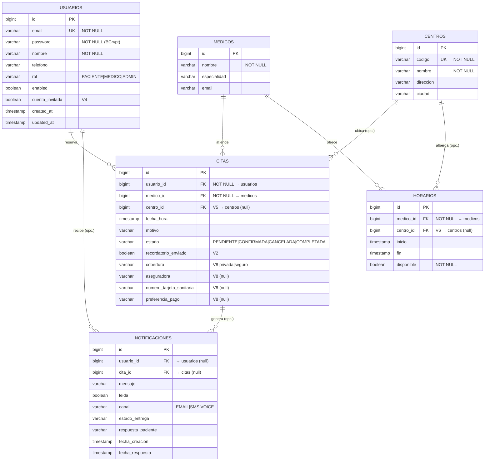

# Base de datos — referencia para la defensa

> **TFG DAM · Dr. Agramonte · junio 2026.** Esquema real reconstruido de las migraciones **Flyway V1–V8** (`backend/src/main/resources/db/migration/postgresql/`). **PostgreSQL 15.** Hibernate arranca con `ddl-auto: validate`, así que el esquema de esta referencia coincide exactamente con las entidades JPA.

## Resumen en una frase
6 tablas en **3ª forma normal**, claves `BIGSERIAL`, integridad referencial con **claves foráneas** (unas en `CASCADE`, otras en `SET NULL` según convenga conservar o no el dato), un **índice único** que —junto al bloqueo pesimista— evita las dobles reservas, e **índices** sobre las consultas más frecuentes.

---

## Diagrama relacional (entidad-relación)

> En GitHub este bloque se dibuja solo. Para el PowerPoint: ábrelo en GitHub o en <https://mermaid.live>, y haz captura. El mismo modelo está, en versión TikZ, en la memoria (figura «Modelo entidad-relación», `docs/tikz-diagrama-er.tex`).

---

## Esquema tabla a tabla

### `usuarios` — pacientes, médicos y administradores (todos)
| Columna | Tipo | Restricción / nota |
|---|---|---|
| `id` | BIGSERIAL | **PK** |
| `email` | VARCHAR(255) | **NOT NULL, UNIQUE** (login) |
| `password` | VARCHAR(255) | NOT NULL — hash **BCrypt(12)**, nunca texto plano |
| `nombre` | VARCHAR(255) | NOT NULL |
| `telefono` | VARCHAR(255) | nullable (para avisos Twilio) |
| `rol` | VARCHAR(50) | NOT NULL, default `PACIENTE` — enum `Rol` |
| `enabled` | BOOLEAN | NOT NULL, default TRUE |
| `cuenta_invitada` | BOOLEAN | NOT NULL, default FALSE — **V4** (reserva sin registro) |
| `created_at`, `updated_at` | TIMESTAMP | auditoría básica |

### `medicos` — catálogo de especialistas
| Columna | Tipo | Restricción |
|---|---|---|
| `id` | BIGSERIAL | **PK** |
| `nombre` | VARCHAR(255) | NOT NULL |
| `especialidad` | VARCHAR(255) | nullable |
| `email` | VARCHAR(255) | nullable |

### `centros` — ubicaciones de consulta (**V5**)
| Columna | Tipo | Restricción |
|---|---|---|
| `id` | BIGSERIAL | **PK** |
| `codigo` | VARCHAR(50) | **NOT NULL, UNIQUE** — identificador interno (`madrid`, `palma`) |
| `nombre` | VARCHAR(255) | NOT NULL |
| `direccion`, `ciudad` | VARCHAR(255) | nullable |

> ⚠️ **Ojo defensa:** los códigos `madrid`/`palma` son **identificadores internos heredados**; los dos centros reales están en **Palma de Mallorca** (V7 renombró: `madrid`→«Consulta General Riera», `palma`→«Consulta Avenidas»). No se cambió el código para no romper las citas/horarios ya enlazados.

### `horarios` — agenda real (franjas de 30 min)
| Columna | Tipo | Restricción |
|---|---|---|
| `id` | BIGSERIAL | **PK** |
| `medico_id` | BIGINT | **FK → medicos**, NOT NULL, `ON DELETE CASCADE` |
| `centro_id` | BIGINT | **FK → centros**, nullable, `ON DELETE SET NULL` — **V6** |
| `inicio`, `fin` | TIMESTAMP | franja horaria |
| `disponible` | BOOLEAN | NOT NULL, default TRUE — pasa a FALSE al reservar |

Índice **UNIQUE `(medico_id, inicio)`** → no puede haber dos franjas idénticas para el mismo médico. **Es la pieza clave de la integridad de reservas.**

### `citas` — la reserva en sí
| Columna | Tipo | Restricción / nota |
|---|---|---|
| `id` | BIGSERIAL | **PK** |
| `usuario_id` | BIGINT | **FK → usuarios**, NOT NULL, `ON DELETE CASCADE` |
| `medico_id` | BIGINT | **FK → medicos**, NOT NULL, `ON DELETE CASCADE` |
| `centro_id` | BIGINT | **FK → centros**, nullable, `ON DELETE SET NULL` — **V5** |
| `fecha_hora` | TIMESTAMP | momento de la cita |
| `motivo` | VARCHAR(500) | nullable |
| `estado` | VARCHAR(50) | enum `EstadoCita`: PENDIENTE / CONFIRMADA / CANCELADA / COMPLETADA |
| `recordatorio_enviado` | BOOLEAN | NOT NULL, default FALSE — **V2** (evita reenviar el aviso 24 h) |
| `cobertura` | VARCHAR(20) | **V8** — `privada` o `seguro` |
| `aseguradora` | VARCHAR(100) | **V8** — nullable (si paga por seguro) |
| `numero_tarjeta_sanitaria` | VARCHAR(100) | **V8** — nullable |
| `preferencia_pago` | VARCHAR(20) | **V8** — nullable (`en-consulta` / `online`) |

> La cita **hereda el centro de su horario** (no se elige aparte): al reservar, `centro_id` se toma del horario bloqueado.

### `notificaciones` — avisos (Twilio / email)
| Columna | Tipo | Restricción |
|---|---|---|
| `id` | BIGSERIAL | **PK** |
| `usuario_id` | BIGINT | FK → usuarios, nullable, `ON DELETE SET NULL` |
| `cita_id` | BIGINT | FK → citas, nullable, `ON DELETE SET NULL` |
| `mensaje` | VARCHAR(255) | |
| `leida` | BOOLEAN | NOT NULL, default FALSE |
| `canal` | VARCHAR(50) | enum `CanalNotificacion`: EMAIL / SMS / VOICE |
| `estado_entrega`, `respuesta_paciente` | VARCHAR(255) | seguimiento del envío y respuesta |
| `fecha_creacion`, `fecha_respuesta` | TIMESTAMP | |

---

## Relaciones e integridad referencial

| Relación | Cardinalidad | `ON DELETE` | Por qué |
|---|---|---|---|
| usuarios → citas | 1:N | **CASCADE** | si se borra un paciente, sus citas no tienen sentido |
| medicos → citas | 1:N | **CASCADE** | ídem para el médico |
| medicos → horarios | 1:N | **CASCADE** | la agenda pertenece al médico |
| centros → citas | 1:N (opc.) | **SET NULL** | conservar la cita aunque desaparezca el centro (histórico) |
| centros → horarios | 1:N (opc.) | **SET NULL** | ídem para la franja |
| usuarios → notificaciones | 1:N (opc.) | **SET NULL** | conservar el aviso aunque se borre el usuario |
| citas → notificaciones | 1:N (opc.) | **SET NULL** | conservar el aviso aunque se borre la cita |

**Criterio:** `CASCADE` cuando el hijo **no existe sin** el padre (cita/horario sin usuario/médico); `SET NULL` cuando interesa **conservar el histórico** (centro y notificaciones).

---

## Concurrencia: cómo se evita la doble reserva ⭐
Es el punto técnico estrella y se apoya en la BD:
1. **`UNIQUE (medico_id, inicio)`** en `horarios`: a nivel de esquema, dos franjas iguales son imposibles.
2. **Bloqueo pesimista** al reservar: `findByMedicoIdAndInicioAndDisponibleTrueForUpdate` ejecuta un `SELECT … FOR UPDATE` que **bloquea la fila del horario** dentro de la transacción.
3. Dos pacientes a la vez sobre el mismo hueco: la **primera** transacción bloquea la fila, marca `disponible = FALSE` y crea la cita; la **segunda** espera y, al continuar, ya no encuentra el hueco libre → **HTTP 409 Conflict**, sin persistir nada.

Está **probado**: `ReservaPublicaIntegrationTest` lanza dos hilos en paralelo contra el mismo hueco y verifica 201/409 (con PostgreSQL real vía Testcontainers).

---

## Índices (y para qué)
| Índice | Tabla | Sirve a |
|---|---|---|
| `uq_horarios_medico_inicio` (UNIQUE) | horarios | integridad anti-duplicados |
| `idx_horarios_medico_inicio` | horarios | disponibilidad por médico/fecha |
| `idx_horarios_centro` | horarios | agenda por centro |
| `idx_citas_medico_fecha` | citas | agenda del médico |
| `idx_citas_usuario_fecha` | citas | «mis citas» del paciente |
| `idx_citas_centro` | citas | citas por centro |
| `idx_citas_recordatorio` (estado, recordatorio_enviado, fecha_hora) | citas | barrido del recordatorio 24 h |

---

## Decisiones de diseño (resumen para responder rápido)
- **Claves `BIGSERIAL`/`BIGINT`:** autoincremento nativo de PostgreSQL; margen de crecimiento frente a `INT`.
- **Enums como `VARCHAR` + `@Enumerated(STRING)`:** dominios pequeños y estables (estado, rol, canal); legibles en la BD y sin una tabla-catálogo que sería sobre-ingeniería.
- **Columnas nuevas siempre `nullable`** (centro_id V5/V6, recordatorio V2, cobertura V8): no rompen las filas existentes al migrar (compatibilidad hacia atrás).
- **Flyway forward-only:** cada cambio es una migración numerada; el esquema se reconstruye idéntico en cualquier entorno. No hay *undo* automático (edición community): se corrige con una nueva V.
- **Normalización 3FN:** sin datos repetidos; cada hecho vive en un único sitio y se referencia por FK.

---

## Preguntas típicas de defensa (con respuesta)
- **¿Por qué relacional y no NoSQL?** → Datos fuertemente interrelacionados (usuario–médico–horario–centro–cita) e invariante crítica (no doble reserva) que exige transacciones ACID y bloqueo de fila. NoSQL documental se reserva para el historial clínico (línea futura, persistencia políglota).
- **¿Cómo garantizas que no se reserve dos veces el mismo hueco?** → `UNIQUE(medico_id, inicio)` + `SELECT FOR UPDATE`; la 2ª transacción recibe 409. Hay test de integración que lo demuestra.
- **¿Qué pasa si borras un centro?** → Las citas/horarios de ese centro **no se borran**: su `centro_id` queda a `NULL` (se conserva el histórico). En cambio, borrar un usuario o un médico **sí** arrastra (CASCADE) sus citas/horarios.
- **¿Qué es `cuenta_invitada`?** → Permite reservar sin registrarse: se crea un usuario marcado como invitado, con contraseña aleatoria; puede «ascender» a cuenta completa más tarde sin perder sus citas.
- **¿Por qué un centro tiene código `madrid` si está en Palma?** → Es un identificador interno heredado; V7 actualizó los nombres reales (ambos en Palma) sin tocar el código, para no romper las citas ya enlazadas. Es una decisión consciente de compatibilidad.
- **¿La cita guarda en qué centro es?** → Sí, en `centro_id`, que **hereda del horario** reservado (la agenda está repartida por centro y día).
- **¿Guardas datos sensibles (tarjeta sanitaria)?** → Sí, desde V8, para que el profesional gestione la cobertura; en un despliegue real convendría cifrarlo/minimizarlo (RGPD: dato de salud) — recogido como mejora.
- **¿Por qué no una tabla de «pagos»?** → De momento solo se **captura** la cobertura/preferencia en la propia cita; no hay cobro. Cuando se integre la pasarela (Stripe, línea futura) tendría sentido una tabla `pagos` con su ciclo de estados.
- **¿Migraciones reversibles?** → Forward-only con Flyway; cada cambio es una nueva versión. Reproducible y trazable, que es lo que importa para la defensa.
