# La aplicación, pantalla a pantalla

Un recorrido por la aplicación para quien prefiera verla sin tocar nada. Si quieres probarla
tú, la [demo pública](https://maragramonte.github.io/dr-agramonte/) es el mismo frontend con
una API simulada en el navegador.

Las capturas salen de esa misma compilación de la demo, así que la interfaz es la real —
las mismas páginas, el mismo CSS y el mismo `api-client.js` que la imagen de producción— y
los datos son ficticios. Solo se ha ocultado la franja «DEMO» del pie, que no forma parte
del producto.

[← Volver al README](../README.md)

---

## 1. Portada

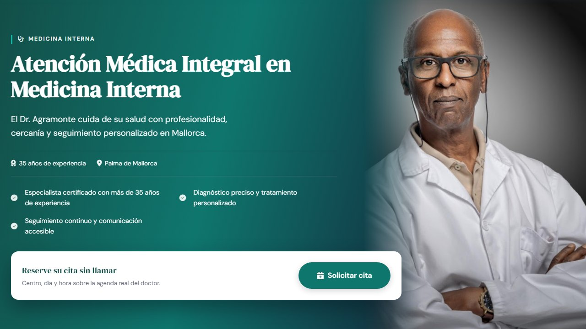

Lo primero que ve un paciente. El camino corto a lo que viene a hacer —pedir cita— está en
la tarjeta inferior, sin obligarle a bajar ni a buscar un teléfono.

## 2. Servicios

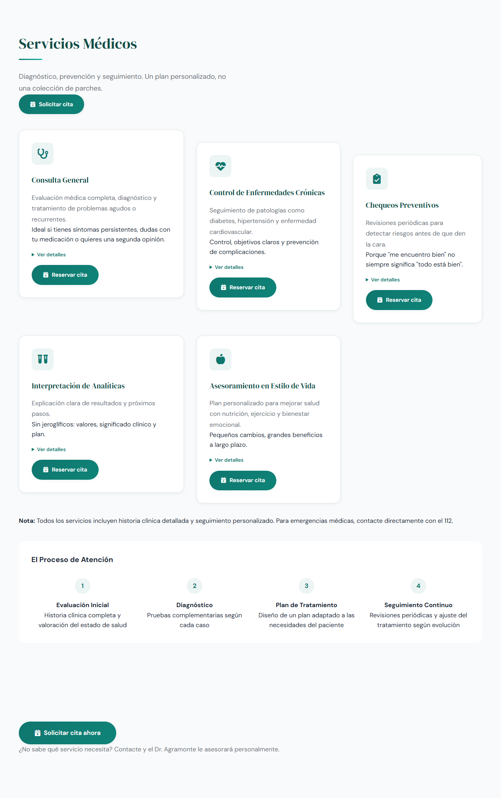

Cada tarjeta lleva a la reserva con el servicio ya elegido (`reservar.html?servicio=…`), de
modo que el paciente no tiene que volver a decidir lo que ya decidió aquí.

## 3. Reservar: el centro manda sobre el calendario

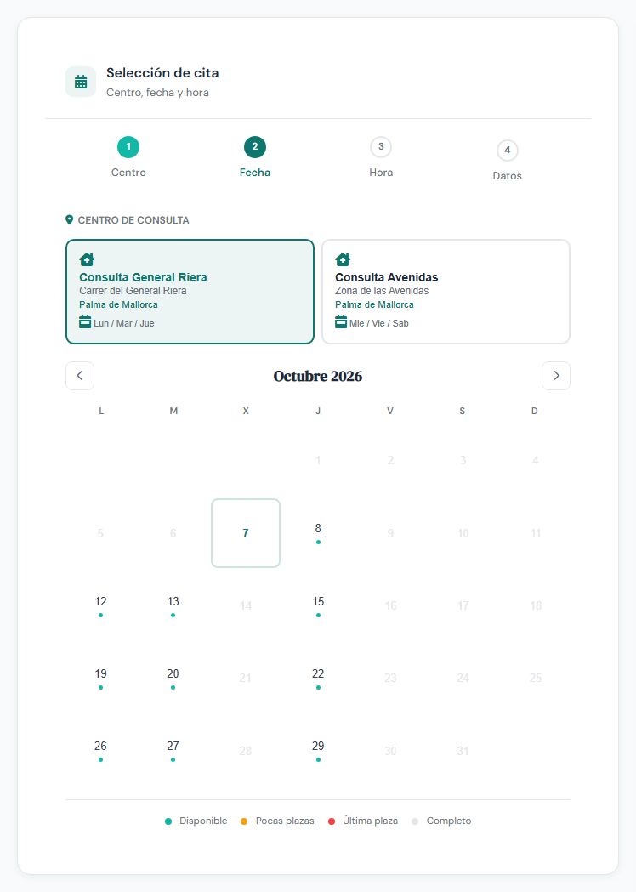

El doctor pasa consulta en dos centros y en días distintos. Al elegir uno, el calendario
apaga los días en que ese centro no abre: en la captura, el centro de General Riera solo
deja pulsar lunes, martes y jueves. Ese reparto no es cosa del navegador, vive en la base de
datos desde la migración V6 (ver [BASE-DE-DATOS.md](BASE-DE-DATOS.md)).

## 4. Reservar: huecos y formulario, a la vez

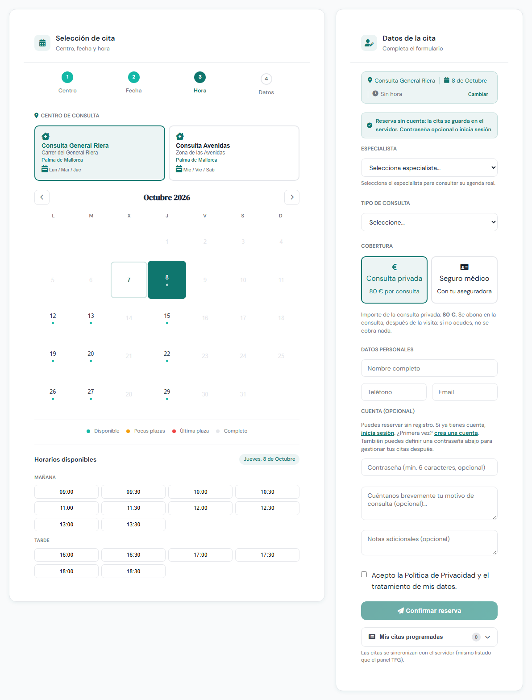

Los huecos libres salen de la agenda del médico para ese centro y ese día. En producción los
calcula el servidor (`GET /api/disponibilidad`), no el navegador: es lo que impide que dos
pacientes vean libre la misma franja. El formulario se rellena en paralelo, sin pasos
intermedios ni recargas.

## 5. Los datos de la cita

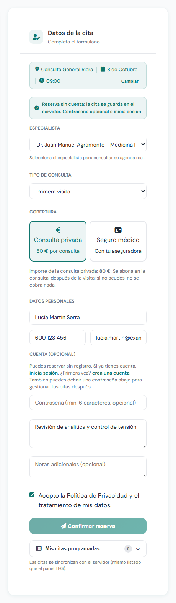

Tipo de consulta y cobertura. Si el paciente elige seguro médico, el formulario pide la
aseguradora; si elige privada, enseña el importe y cuándo se abona. La cuenta es
opcional: se puede reservar sin registrarse y poner contraseña después.

## 6. Mis citas

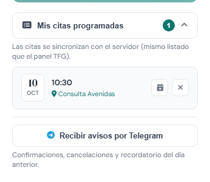

El mismo listado que ve el médico en su agenda, no una copia local: sale del servidor y se
sincroniza entre las tres vistas de citas de la aplicación (ver
[SINCRONIZACION-CITAS.md](SINCRONIZACION-CITAS.md)). Desde aquí se exporta al calendario o
se cancela.

## 7. Avisos por Telegram

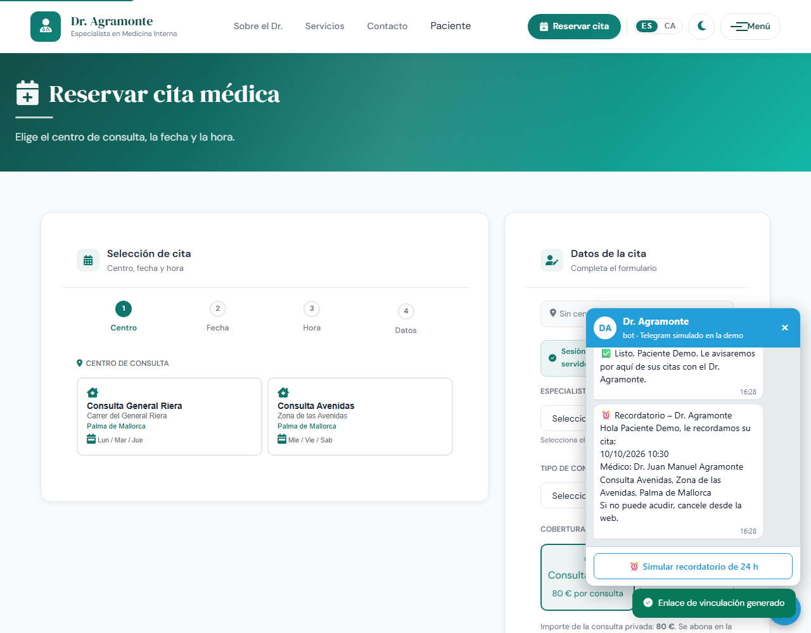

La vinculación usa un token de un solo uso con 15 minutos de validez, emitido siempre para
el usuario del JWT en sesión. A partir de ahí llegan la confirmación, la cancelación y el
recordatorio del día anterior. En la demo el chat está simulado dentro de la página, con los
textos exactos de `CitaNotificationService`; en producción es un bot de verdad.

## 8. Cuadro de mando del médico

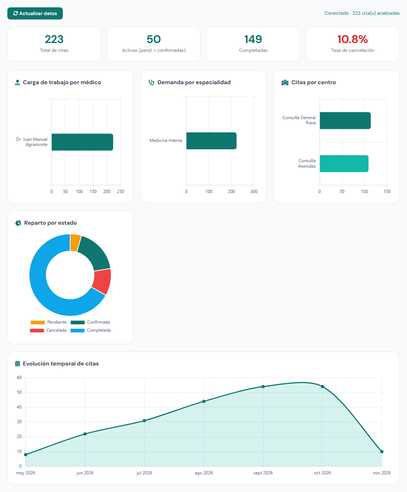

Detrás de cada gráfico hay una consulta agregada con `GROUP BY`, no un cálculo en el
navegador. El acceso exige rol `MEDICO` o `ADMIN`: un paciente con sesión iniciada recibe un
403 y no ve la página.

## 9. En el móvil

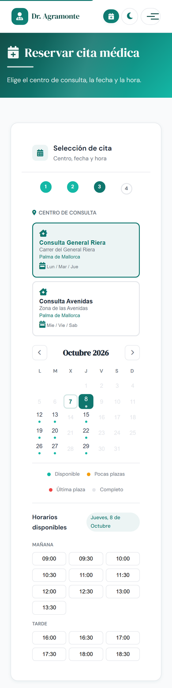

El mismo HTML en 390 px de ancho: los centros se apilan, el calendario entra entero y los
huecos pasan a tres columnas. La maquetación se comprueba de 320 a 2560 px buscando scroll
horizontal y textos cortados.

## 10. Modo oscuro

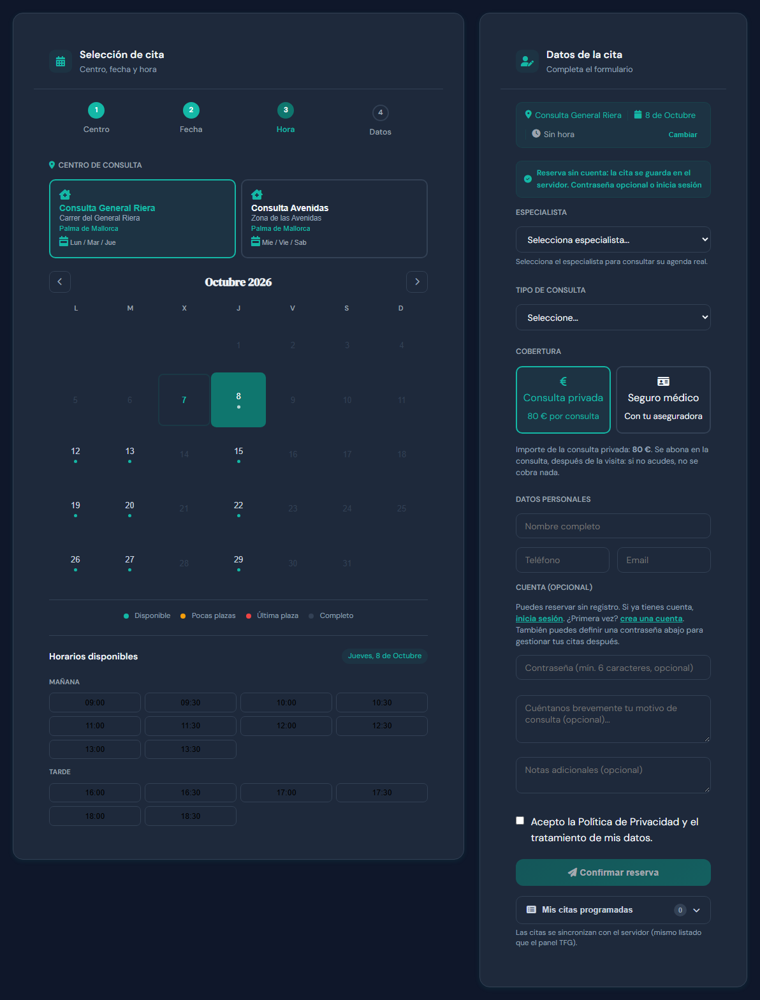

El tema se fija antes de pintar para que no haya parpadeo. El contraste de los dos temas se
audita sobre los colores calculados de cada texto contra su fondo real, aplicando la fórmula
de luminancia de la WCAG.

## 11. En catalán

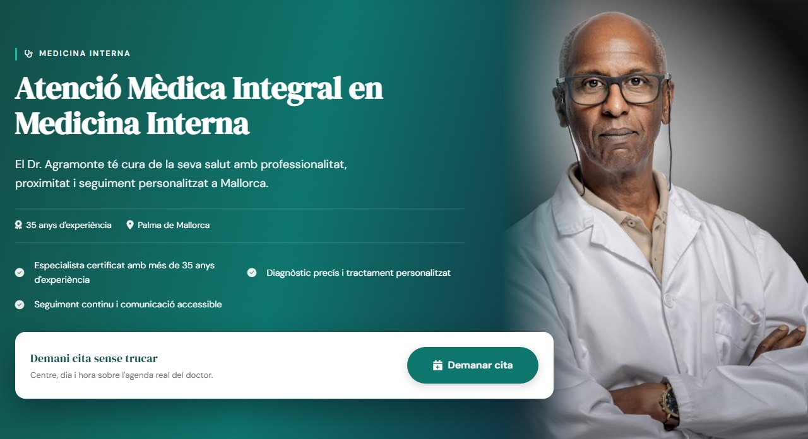

Traducción por atributos `data-i18n`, sin librería ni dependencias, con la preferencia
guardada en el navegador.

## 12. Sin conexión

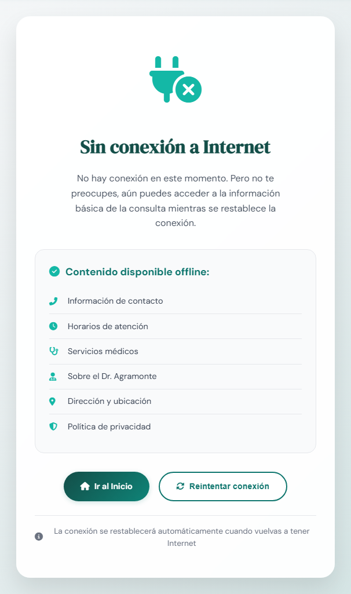

La aplicación es una PWA instalable. Cuando no hay red, el service worker sirve esta página
y deja a mano lo que ya estaba en caché, en vez del error del navegador.

---

## Cómo están hechas estas capturas

Con Chrome contra la compilación de la demo servida en local, no a mano:
[`scripts/capturar-pantallas.sh`](../scripts/capturar-pantallas.sh) las regenera todas (o una
suelta, pasándole su nombre), sin necesidad de Docker ni base de datos. Prepara cada
escenario —elegir centro y día, entrar como paciente o como médico, cambiar de idioma o de
tema—, espera a que la pantalla esté montada y recorta por el rectángulo del elemento.

Va por el protocolo de DevTools y no por `chrome --screenshot`, por dos motivos. El primero
es el ancho de móvil: por línea de órdenes Chrome no baja de unos 500 px de ventana, se le
piden 390 y da 504, y recortar después el PNG simularía desbordes que no existen; con
emulación de dispositivo el viewport es de 390 px de verdad. El segundo es el momento del
disparo, que así espera a que la página avise de que está lista en vez de confiar en el
tiempo virtual.

Queda una rareza del modo *headless*: con la página más alta que el viewport, el día elegido
del calendario se pinta sin su relleno. Antes de capturar esas pantallas el viewport se
estira a la altura de la página —lo mismo que hace DevTools al capturar a tamaño completo— y
el guion comprueba el color en el PNG, para no publicar una captura que engañe.

Lo que ninguna captura puede enseñar es la concurrencia: el bloqueo pesimista que impide que
dos pacientes se queden con el mismo hueco solo existe contra PostgreSQL, y de eso se ocupan
las pruebas de integración con Testcontainers.
