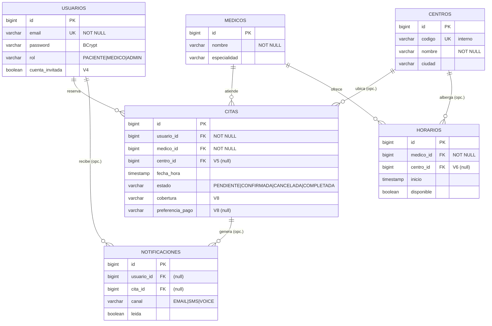

# Defensa Dr. Agramonte — Guion cronometrado (15 min) + banco de preguntas

> **TFG DAM · CESUR · Mar Agramonte · Junio 2026**
> Guion hablado **minuto a minuto para 15 min exactos** + banco de preguntas. Pensado para **ensayar en voz alta**.
> **Regla de oro:** solo afirmar lo que tiene código detrás. Lo no construido se presenta como *línea futura*, nunca como hecho. La coherencia **memoria ↔ código ↔ demo** es lo que más puntúa.

---

## Reparto del tiempo (visión global)

| Bloque | Tramo | Duración | Acumulado |
|---|---|---|---|
| 1. Apertura | 0:00 – 0:45 | 45 s | 0:45 |
| 2. El problema | 0:45 – 2:30 | 1 min 45 s | 2:30 |
| 3. Propuesta y alcance | 2:30 – 3:30 | 1 min | 3:30 |
| 4. Arquitectura y stack | 3:30 – 5:30 | 2 min | 5:30 |
| 5. **Demo en vivo** (núcleo) | 5:30 – 10:00 | 4 min 30 s | 10:00 |
| 6. Puntos técnicos fuertes | 10:00 – 12:30 | 2 min 30 s | 12:30 |
| 7. Limitaciones y líneas futuras | 12:30 – 13:45 | 1 min 15 s | 13:45 |
| 8. Objetivos cumplidos | 13:45 – 14:30 | 45 s | 14:30 |
| 9. Cierre | 14:30 – 15:00 | 30 s | 15:00 |

> Si vas con prisa: recorta el bloque 6 a dos puntos. Si sobra tiempo: añade la prueba de concurrencia en vivo (bloque 5).

---

## 0 · Checklist de 2 minutos antes de entrar

- [ ] `docker compose up -d --build` y backend **healthy** (`docker compose ps`).
- [ ] Pestañas abiertas en el navegador, en este orden:
  1. `http://localhost` (inicio)
  2. `http://localhost/reservar.html`
  3. `http://localhost/panel-pruebas.html`
  4. `http://localhost/estadisticas.html` (cuadro de mando)
- [ ] Credenciales del médico a mano: `dr.agramonte@example.com` / `Medico123!`
- [ ] Crear **2–3 reservas de prueba** antes de empezar para que el dashboard y el panel no salgan vacíos.
- [ ] Modo claro activado (mejor contraste en proyector), zoom del navegador al 110–125 %.
- [ ] Memoria PDF abierta en el diagrama de arquitectura y, si puedes, una terminal con `mvn test` ya pasado (captura del verde).
- [ ] **Plan B** por si cae el backend: capturas/vídeo del flujo + el diagrama de arquitectura.

---

## 1 · Apertura — *0:00 a 0:45* (45 s)

> Mira al tribunal, no a la pantalla. Frases cortas.

«Buenos días. Soy **Mar Agramonte** y presento **Dr. Agramonte**, una plataforma web de gestión de citas médicas para **consultas pequeñas y médicos autónomos**.

La idea no es inventada: nace de un problema real que he observado de cerca, durante años, en el entorno sanitario. En los próximos minutos os contaré ese problema, cómo lo he resuelto técnicamente y os lo enseñaré funcionando.»

---

## 2 · El problema — *0:45 a 2:30* (1 min 45 s)

- Un médico **no desconecta** cuando cierra la consulta: el teléfono sigue sonando en festivos, vacaciones, a las diez de la noche.
- La mayoría de esas llamadas **no son urgencias clínicas**, sino **gestión de agenda**: confirmar, cambiar o cancelar una cita.
- En consultas pequeñas muchas veces **no hay personal administrativo**, así que ese trabajo recae sobre el propio médico, que interrumpe lo que está haciendo con el paciente que tiene delante.

> «Mi objetivo **no es sustituir el trato humano** —cuando alguien llama asustado, eso no lo resuelve una app—, sino **digitalizar la parte administrativa** para devolverle tiempo al profesional.»

- Y hay un **hueco de mercado** claro: el hospital grande y la clínica privada importante ya tienen cita online (Doctoralia, Top Doctors), pero el **médico independiente** sigue con teléfono y agenda de papel. Las plataformas existentes le cobran comisiones pensadas para grandes volúmenes y, sobre todo, **le quitan la titularidad de sus datos**.

> «Dr. Agramonte se diseña justo para ese espacio intermedio: una herramienta **propia, simple y bajo el control del consultorio**.»

---

## 3 · Propuesta y alcance — *2:30 a 3:30* (1 min)

- El **paciente** puede registrarse, iniciar sesión **o reservar como invitado** (sin cuenta), ver servicios y reservar / consultar / cancelar citas online, 24/7.
- El **médico** recibe avisos por SMS/WhatsApp y dispone de una agenda y un **cuadro de mando de gestión**.

> **Honestidad con el alcance** (esto puntúa):
> «Lo **entregado** es la plataforma de citas completa, segura y desplegable. Lo que queda fuera —historial clínico real, pasarela de pago, app nativa— lo presento como **evolución futura**, no como algo hecho. Toda esta memoria describe la versión *real* del sistema a junio de 2026.»

---

## 4 · Arquitectura y stack — *3:30 a 5:30* (2 min)

> Apóyate en el **diagrama de arquitectura** de la memoria.

- **Arquitectura en tres capas, en contenedores Docker:**
  **nginx** (sirve la web y hace de proxy inverso de `/api`) → **Spring Boot** (API, seguridad, negocio) → **PostgreSQL** (datos transaccionales). Twilio es un servicio externo para SMS/WhatsApp.
- **Backend: Java 21 + Spring Boot 3.5.3**, patrón clásico *controller → service → repository*, con **DTOs**: nunca expongo entidades JPA al exterior (desacopla la API del modelo y no filtra campos internos).
- **Frontend: HTML, CSS y JavaScript nativo, sin framework.** Fue una decisión consciente: la app no tiene un estado global tan complejo como para justificar React; evitarlo reduce dependencias, acelera la carga y mantiene el código legible.
- **Persistencia versionada con Flyway** (migraciones V1–V8): cualquier entorno —el mío o el del tribunal— se reconstruye **idéntico** al arrancar.
- **Docker Compose** levanta todo con un único comando → se acabó el «en mi máquina funciona».

> «Saber **cuándo no** añadir una tecnología, como React, es tan importante como saber usarla.»

---

## 5 · Demostración en vivo — *5:30 a 10:00* (4 min 30 s) — **EL NÚCLEO**

> No narres cada clic. Cuenta *qué* demuestras con cada paso.

1. **Reserva como invitado** en `reservar.html`: centro → calendario → hora → datos → confirmar.
   > «Sin obligar a registrarse: obligar a crear cuenta es una de las grandes causas de abandono.»

2. **Una sola fuente de verdad.** Abre `panel-pruebas.html`: la misma reserva está en la tabla, porque sale de **la base de datos**, no del navegador.
   > «El `localStorage` es solo caché de UI; la verdad está en PostgreSQL.»

3. **Login médico** (`dr.agramonte@example.com`) → enseña la **agenda** y, sobre todo, el **cuadro de mando** (`estadisticas.html`): carga por médico, demanda por especialidad, reparto por centro y **tasa de cancelación**.
   > «La clínica entendida como empresa: estos datos los calcula la **base de datos** con `GROUP BY`, no el navegador.»

4. **Control de acceso por rol** (rápido): el dashboard solo lo ve MEDICO/ADMIN; sin sesión válida da **403**.

5. **Accesibilidad:** pulsa **Tab** al cargar → aparece el enlace «Ir al contenido principal». Cambia a **modo oscuro**.

> **Si el backend cae → Plan B sin perder la calma:** capturas/vídeo del flujo + el diagrama de arquitectura, y sigues hablando con normalidad.

---

## 6 · Puntos técnicos fuertes — *10:00 a 12:30* (2 min 30 s)

> Elige y cuenta **3–4 con seguridad**. Son tu terreno.

- **Concurrencia (lo más interesante):** ¿qué pasa si dos pacientes reservan la misma franja a la vez? Uso **bloqueo pesimista** `SELECT … FOR UPDATE` sobre el horario: la primera transacción gana y la segunda recibe **409 Conflict**, de forma determinista. Y no lo afirmo en el papel: está **verificado bajo concurrencia real**, dos transacciones simultáneas en hilos distintos sobre una PostgreSQL real. Además la notificación a Twilio se envía **tras el commit**, para no bloquear la fila durante una llamada de red ni avisar de una cita que no llegó a persistir.

- **Seguridad:** **JWT** *stateless* + autorización por rol (PACIENTE / MEDICO / ADMIN) en `SecurityConfig`; contraseñas con **BCrypt (factor 12)**, nunca en claro; análisis de vulnerabilidades con **OWASP dependency-check** en el `pom.xml`.

- **Cuadro de mando (módulo SGE):** analítica agregada calculada **en la base de datos** con `GROUP BY` y proyecciones ligeras (no se trae todo a memoria), restringida por rol.

- **Accesibilidad (WCAG 2.1 AA):** contraste verificado con la **fórmula de luminancia**, foco visible, navegación completa por teclado, enlace «saltar al contenido», `lang`, etiquetas en formularios y respeto de `prefers-reduced-motion`.

- **Calidad:** **batería de pruebas automatizadas** en tres niveles —unitarias (`CitaServiceTest`, `JwtProviderTest`), de seguridad/RBAC (`CitaControllerWebMvcTest`) e **integración end-to-end con Testcontainers + PostgreSQL real** (`ReservaPublicaIntegrationTest`)— sobre los caminos críticos.

---

## 7 · Limitaciones honestas y líneas futuras — *12:30 a 13:45* (1 min 15 s)

> Adelántate a las preguntas trampa. Esto demuestra madurez.

- «La cobertura **no está medida con JaCoCo**; la valido cualitativamente por ramas críticas (409 doble reserva, 403 por rol, JWT, cancelación).»
- «No hay **historial clínico** real, ni réplicas/failover, ni MongoDB: son evoluciones naturales, no carencias del alcance entregado. De hecho, **el historial clínico es el candidato ideal a NoSQL documental** → una persistencia políglota futura.»
- «La reserva por invitado es **adecuada para un prototipo**; en producción la reforzaría con enlace firmado u **OTP**.»
- «El dominio **dragramonte.com** ya está registrado; el siguiente paso de producto es el **despliegue en la nube con HTTPS** apuntándolo.»

---

## 8 · Objetivos cumplidos — *13:45 a 14:30* (45 s)

> Cierra el círculo con los objetivos del capítulo 2.

«Me marqué **ocho objetivos específicos**, cada uno con código real detrás y, donde aplica, una prueba que lo respalda: el modelo de datos en PostgreSQL con Flyway, la API REST con JWT y roles, la integridad de reservas con bloqueo pesimista, el frontend accesible y PWA, las notificaciones Twilio, el despliegue con Docker Compose, la calidad con pruebas y análisis de vulnerabilidades, y el cuadro de mando de gestión. **Los ocho están cumplidos y son demostrables.**»

---

## 9 · Cierre — *14:30 a 15:00* (30 s)

«En resumen: una aplicación **funcional, desplegable y probada**, que resuelve un problema real con decisiones de ingeniería justificadas. Y, sobre todo, un documento **alineado al 100 % con el código** que acabo de enseñar.

Gracias por vuestra atención; quedo a vuestra disposición para las preguntas.»

---

## Frases de cierre / efecto (para tener en la recámara)

- «El navegador nunca es la verdad; solo refleja la base de datos tras cada sincronización.»
- «En sanidad, la continuidad importa: por eso hay degradación controlada y un entorno reproducible.»
- «No quería una idea enorme a medias, sino un proyecto pequeño y sólido, terminado de verdad.»
- «Elegí la herramienta adecuada para cada dato: relacional para el núcleo transaccional, NoSQL reservado para el historial clínico.»
- «Saber cuándo *no* añadir una tecnología es tan importante como saber usarla.»

---

## Banco de preguntas y respuestas

> Respuestas en **una o dos frases**. Si quieres ampliar, hazlo después.

### Funcionales
- **¿Qué pasa si dos pacientes reservan la misma hora a la vez?** → Hay un bloqueo pesimista (`SELECT FOR UPDATE`) sobre el horario; la primera transacción gana y la segunda recibe **HTTP 409 Conflict**. Tengo un test de integración que lo demuestra.
- **¿Cómo reserva alguien sin cuenta?** → Endpoint `reserva-publica`: el backend crea o reutiliza una *cuenta invitada* (`cuenta_invitada=true`) y persiste la cita en BD; luego puede consultar por su email. Es un prototipo; en producción usaría enlace firmado u OTP.
- **¿Dónde se guardan las citas?** → En PostgreSQL. El `localStorage` del navegador es solo caché de UI que se rellena desde la API.

### Arquitectura
- **¿Por qué Spring Boot?** → Tipado fuerte (errores en compilación, importante con datos de salud), Spring Security maduro, JPA y transacciones ACID.
- **¿Por qué sin framework en el frontend?** → La app no tiene un estado global complejo; evitarlo reduce dependencias, acelera la carga y mantiene el código legible. Es una decisión, no una carencia.
- **¿Qué son los DTO y por qué los usas?** → Objetos de transferencia que desacoplan la API de las entidades JPA: no expongo el modelo interno y controlo exactamente qué viaja.

### Acceso a datos / base de datos

> **Modelo relacional (6 tablas, Flyway V1–V8).** Referencia completa en [BASE-DE-DATOS.md](BASE-DE-DATOS.md). Si el tribunal lo pide, enseña este diagrama:

> **Clave anti-doble-reserva:** índice `UNIQUE (medico_id, inicio)` en `horarios` + `SELECT … FOR UPDATE`. **Integridad:** citas/horarios en `CASCADE` (no existen sin su usuario/médico); `centro_id` y notificaciones en `SET NULL` (conservar histórico).

- **¿Por qué relacional y no MongoDB?** → Los datos son fuertemente relacionales (usuario–médico–horario–centro–cita) y la invariante crítica (no doble reserva) exige transacciones y bloqueo de fila, donde el relacional es más fuerte. MongoDB lo reservo para el historial clínico (documentos flexibles): una persistencia políglota futura.
- **¿Qué es Flyway?** → Versiona el esquema en migraciones numeradas (V1–V8); cualquier entorno se reconstruye igual al arrancar.
- **¿Cómo evitas perder trazabilidad al cancelar?** → No borro la fila; cambio el `estado` (enumerado `EstadoCita`).

### Seguridad / RGPD
- **¿Cómo funciona la autenticación?** → JWT firmado en la cabecera `Authorization: Bearer`; el servidor es *stateless*. Es un token único (sin *refresh token*, que es línea futura).
- **¿Cómo controlas permisos?** → Autorización por rol en `SecurityConfig`; un paciente no puede acceder a rutas de médico/admin → recibe **403**. Probado con `@WebMvcTest`.
- **¿Cómo guardas las contraseñas?** → Cifradas con **BCrypt** (factor 12), nunca en claro.
- **¿RGPD?** → Política de privacidad, consentimiento explícito en el formulario, minimización de datos, secretos fuera del repositorio (`.env`).
- **¿Analizas vulnerabilidades?** → Sí, **OWASP dependency-check** en el `pom.xml`; el build falla con CVSS ≥ 7.

### Cuadro de mando / SGE
- **¿Para qué sirve el dashboard?** → Entender la clínica como empresa: carga por médico, especialidades más demandadas, reparto por centro y **tasa de cancelación** (aproximación al ausentismo).
- **¿Cómo se calcula?** → Con consultas de agregación `GROUP BY`/`COUNT` en PostgreSQL y proyecciones ligeras; el cálculo se hace en la BD, no trayendo todo a memoria. Es más eficiente.
- **¿Quién puede verlo?** → Solo rol MEDICO/ADMIN; sin sesión válida da 403. Verificado en vivo.

### Accesibilidad / IPO
- **¿Cómo garantizas la accesibilidad?** → Tomé como referencia **WCAG 2.1 nivel AA**: contraste verificado con la fórmula de luminancia (texto principal 14:1, botones 5,5:1), foco visible, navegación completa por teclado, enlace «saltar al contenido» (WCAG 2.4.1), `lang`, etiquetas en formularios y respeto de `prefers-reduced-motion`.
- **¿Por qué importa aquí?** → Muchos pacientes son personas mayores o con baja visión; si no pueden usarla, la herramienta no cumple su función.
- **¿La has auditado con herramientas?** → Verifiqué el contraste manualmente; la auditoría automática (Lighthouse/axe) y pruebas con lector de pantalla son línea futura.

### Sostenibilidad
- **¿Qué tiene de sostenible?** → Dos frentes: digitaliza (menos papel y desplazamientos, ODS 12) y consume poco al ejecutarse (sin framework pesado, recursos vendorizados, agregación en BD, una sola base de datos, contenedores ligeros *just-enough*).
- **¿Lo has medido?** → No con instrumentos; es una justificación cualitativa por arquitectura. Medir la huella sería el siguiente paso.

### Pruebas / calidad
- **¿Qué pruebas tienes?** → 25 tests en 3 niveles: unitarias (`CitaServiceTest`, `JwtProviderTest`, `DatabaseUrlEnvironmentPostProcessorTest`), de seguridad/RBAC (`CitaControllerWebMvcTest`, `GlobalExceptionHandlerTest`) e integración end-to-end con **Testcontainers + PostgreSQL real** (`ReservaPublicaIntegrationTest`).
- **¿Cobertura?** → No la mido con JaCoCo todavía; cubro las ramas críticas (409 doble reserva, 403 por rol, JWT, cancelación). Añadir JaCoCo es una mejora pendiente.
- **¿Pruebas E2E?** → No automatizadas aún (Playwright es línea futura); las hago manualmente.

### Despliegue / Docker
- **¿Cómo se despliega?** → `docker compose up -d --build`: levanta postgres, backend y nginx con comprobaciones de salud y orden de arranque. El backend es un JAR con servidor embebido.
- **¿Y en producción?** → El dominio **dragramonte.com** ya está registrado; queda el despliegue en la nube con HTTPS apuntándolo (línea futura).

### Preguntas "trampa" / honestidad (prepáralas, son las que más puntúan bien si respondes con calma)
- **¿Usas bloqueo optimista con `@Version`?** → No. Uso bloqueo **pesimista** (`SELECT FOR UPDATE`) sobre el horario; el efecto es el mismo (la segunda reserva recibe 409) y es determinista en alta concurrencia sobre la misma franja.
- **¿El panel médico es el definitivo?** → No, es un prototipo de TFG; algunas rutas de lectura están abiertas para la demo. El panel clínico con historial real es evolución futura.
- **¿Hay alta disponibilidad / failover?** → No en esta infraestructura; lo que sí tengo es atomicidad: `@Transactional` garantiza que una reserva se completa entera o se revierte (no quedan citas huérfanas).
- **¿Mandas notificaciones push?** → Web Push no; el aviso al móvil es vía **Twilio** (SMS/WhatsApp), incluso más fiable porque llega aunque no tengan la PWA instalada. Web Push es línea futura.

### Negocio / mercado
- **¿Esto es viable comercialmente?** → Sí, para el nicho de médicos autónomos y consultas pequeñas que hoy no usan plataformas como Doctoralia. El valor es que mantienen la **titularidad de sus datos**.
- **¿Qué te diferencia de Doctoralia?** → Está pensado para el profesional independiente, es propio (no un marketplace de terceros) y mucho más simple de adoptar.

---

## Reglas de oro al responder

1. **Honestidad primero.** Si algo no está hecho, dilo y reubícalo como línea futura. El tribunal premia la coherencia, no la exageración.
2. **No te inventes cifras.** Si no lo has medido (cobertura, huella), dilo.
3. **Responde corto y para.** Si quieren más, preguntarán.
4. **Apóyate en evidencias.** «Tengo un test que lo demuestra», «está en `SecurityConfig`», «se ve en el diagrama».
5. **Si no sabes algo:** «No lo implementé, pero el enfoque que seguiría sería…». Mejor que improvisar mal.
6. **Reconduce a tus fortalezas:** concurrencia probada, seguridad por rol, dashboard, accesibilidad, entorno reproducible.

## Errores a evitar

- Leer las diapositivas o la pantalla palabra por palabra.
- Afirmar tecnología que no existe (MongoDB, refresh token, failover, `@Version`).
- Quedarte en blanco si cae el backend → pasa al Plan B (capturas + arquitectura) sin perder la calma.
- Hablar demasiado rápido. Respira entre secciones.
- Menospreciar tu trabajo («es solo un CRUD»): es concurrencia + seguridad + analítica + accesibilidad + despliegue.
</content>
